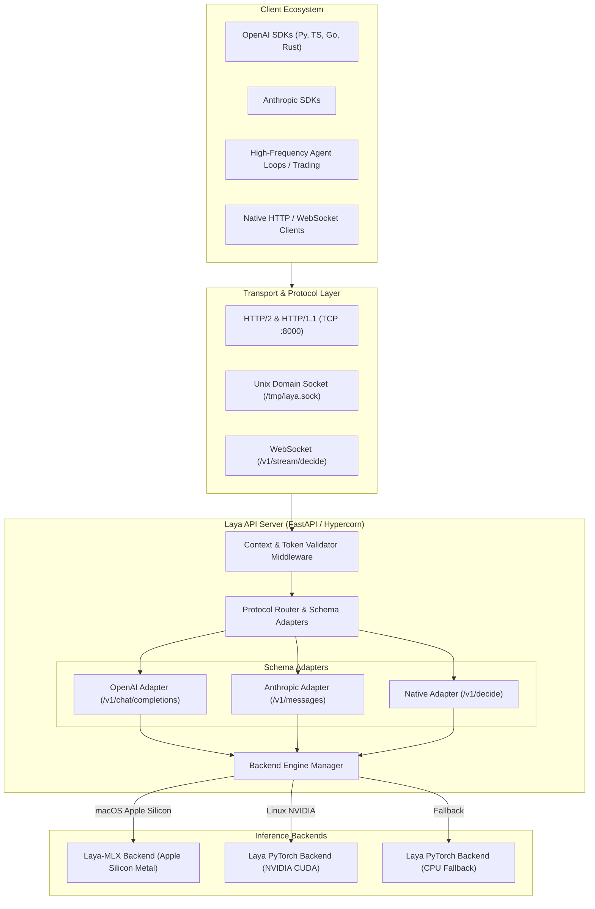

# Laya API Architecture Specification

## 1. Overview & Goals

**Laya API** is an ultra-low latency, OpenAI- and Anthropic-compatible inference server tailored for **Laya** and **Laya-MLX** non-autoregressive decision models.

Unlike traditional autoregressive Large Language Models (LLMs) that generate token-by-token text over hundreds of milliseconds, Laya models perform typed decision-making (classification, routing, verification, scoring, and probability estimation) in a **single forward pass** (~7–14 ms on Apple Silicon MLX and NVIDIA CUDA).

### Primary Objectives:
1. **Drop-in Compatibility**: Support existing OpenAI (`/v1/chat/completions`) and Anthropic (`/v1/messages`) SDKs and agents in any programming language (Python, TypeScript, Go, Rust, Java, C#, etc.).
2. **Multi-Protocol & Low Handshake**: Provide Unix Domain Sockets (UDS), HTTP/2 Keep-Alive pooling, and WebSockets to eliminate network handshake overhead in tight execution loops.
3. **Hardware-Native Execution**:
   - **macOS (Apple Silicon)**: Native MLX backend via `laya-mlx` for direct Unified Memory / Metal GPU access.
   - **Linux / Cloud**: PyTorch backend with CUDA / ROCm / CPU acceleration.
4. **Ingestion-Time Context Validation**: Strict tokenization check before execution to protect against Out-Of-Memory (OOM) and truncation errors.
5. **Zero-Cold-Start Reliability**: Mandatory model pre-loading and JIT warm-up during boot before opening ports.

---

## 2. System Architecture

---

## 3. Request Lifecycle & Validation Pipeline

1. **Ingress & Handshake**:
   - Connection established over HTTP/2 Keep-Alive, WebSocket, or local Unix Domain Socket.
2. **Context Window Check (Ingestion Middleware)**:
   - Request payload is tokenized using the model's native tokenizer.
   - If `token_count > max_context_length`:
     - `on_overflow="error"` (Default): Returns HTTP `400 Bad Request` (`context_length_exceeded`).
     - `on_overflow="truncate_head"`: Truncates oldest tokens, retaining latest context.
     - `on_overflow="truncate_tail"`: Truncates latest tokens, retaining initial prompt structure.
3. **Protocol Normalization**:
   - Prompts extracted from OpenAI `messages` array or Anthropic `messages` / `system` blocks.
4. **Inference Execution**:
   - Single forward pass on selected backend (`laya-mlx` or `torch`).
   - Latency tracked via high-resolution monotonic timer.
5. **Envelope & Serialization**:
   - Result formatted according to target protocol schema (OpenAI Chat, Anthropic Message, or Laya Native).
   - Telemetry headers attached (`X-Laya-Latency-Ms`, `X-Laya-Backend`).
   - If `stream=true`, SSE chunks are emitted with `[DONE]`.

---

## 4. Hardware Backend Strategy

| Environment | Primary Backend | Acceleration | Deployment Mode |
| :--- | :--- | :--- | :--- |
| **macOS (Apple Silicon M1/M2/M3/M4)** | `laya-mlx` | Apple Metal (Unified Memory) | Native CLI / `uv` (`laya-api serve`) |
| **Linux (NVIDIA GPU)** | `laya` (PyTorch) | NVIDIA CUDA (`nvcr.io` / PyTorch CUDA) | Docker (`Dockerfile.cuda`) or Native |
| **Linux / Windows (CPU)** | `laya` (PyTorch) | Intel AVX-512 / ARM Neon | Docker (`Dockerfile.cpu`) or Native |

> [!IMPORTANT]
> Docker on macOS runs inside a Linux virtual machine and cannot access Apple Silicon Metal/GPU acceleration. Therefore, on macOS systems, native execution via `laya-api` CLI or `uv run` is the recommended deployment mode to achieve 7–14ms latency.

---

## 5. Low-Handshake Protocols for High-Frequency Loops

In high-frequency loops (e.g., algorithmic trading, agent guardrails, real-time filtering), network overhead can dominate compute latency:

1. **Unix Domain Socket (`http+unix://`)**:
   - Bypasses TCP/IP stack, firewall, and OS loopback overhead.
   - Ideal for agents co-located on the same host machine.
2. **HTTP/2 Persistent Pool**:
   - Reuses a single TCP connection with binary framing, multiplexing multiple concurrent evaluations without repeated TLS handshakes.
3. **WebSocket Duplex Stream (`/v1/stream/decide`)**:
   - Keeps an open full-duplex socket for continuous `json_in` -> `json_out` messaging.
