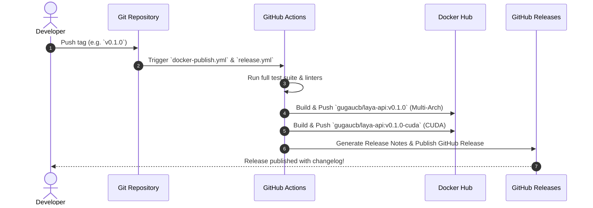

# Laya API: Versioning & Release Strategy

This document outlines the versioning rules, Docker image tagging conventions, and GitHub Release standards for the **Laya API** project.

---

## 1. Semantic Versioning 2.0.0 (SemVer)

Laya API strictly adheres to [Semantic Versioning (SemVer 2.0.0)](https://semver.org/):

$$\text{Format: } \mathbf{MAJOR}.\mathbf{MINOR}.\mathbf{PATCH}$$

### 🔺 When to Bump MAJOR (e.g., `1.0.0` -> `2.0.0`)
- Breaking changes to public REST endpoints (`/v1/chat/completions`, `/v1/messages`, `/v1/decide`).
- Incompatible changes to Question Types syntax or response structures.
- Removal of previously deprecated CLI arguments or transport protocols.

### 🔹 When to Bump MINOR (e.g., `0.1.0` -> `0.2.0`)
- Addition of new endpoints, Question Types (e.g., adding `type: "ranking"`), or transport layers (e.g., gRPC).
- Support for new inference backends (e.g., TensorRT-LLM, ONNX Runtime).
- Backward-compatible additions to request schemas or response metadata.

### 🔸 When to Bump PATCH (e.g., `0.1.0` -> `0.1.1`)
- Bug fixes, security patches, or latency micro-optimizations.
- Documentation additions and correction of typos.
- Dependency updates that do not alter the public interface.

---

## 2. Docker Hub Image Tagging Conventions

Docker images are published to Docker Hub under `gugaucb/laya-api` (or configured organization):

| Image Variant | Target Architecture | Docker Hub Tags | Description |
| :--- | :--- | :--- | :--- |
| **CPU Multi-Arch** | `linux/amd64`, `linux/arm64` | `latest`<br>`vX.Y.Z`<br>`cpu`<br>`vX.Y.Z-cpu` | Lightweight CPU inference image using PyTorch CPU wheels. Default when running without `--gpus`. |
| **NVIDIA CUDA** | `linux/amd64` | `cuda`<br>`vX.Y.Z-cuda` | Accelerated GPU inference image based on `nvidia/cuda:12.2.2-runtime-ubuntu22.04`. |

### Example Pull Commands:
```bash
# Pull latest stable CPU multi-arch image
docker pull gugaucb/laya-api:latest

# Pull specific version for CPU
docker pull gugaucb/laya-api:v0.1.0

# Pull latest NVIDIA CUDA GPU image
docker pull gugaucb/laya-api:cuda

# Pull specific version for NVIDIA CUDA GPU
docker pull gugaucb/laya-api:v0.1.0-cuda
```

---

## 3. Conventional Commits Standard

All commit messages should follow the [Conventional Commits](https://www.conventionalcommits.org/) specification:

- `feat:` A new feature or capability (bumps MINOR).
- `fix:` A bug fix (bumps PATCH).
- `perf:` A code change that improves performance or latency.
- `docs:` Documentation only changes.
- `test:` Adding missing tests or correcting existing tests.
- `refactor:` A code change that neither fixes a bug nor adds a feature.
- `chore:` Maintenance tasks, dependency updates, CI/CD tweaks.
- `BREAKING CHANGE:` In the commit body/footer or `feat!:` in the subject (bumps MAJOR).

---

## 4. Release Automation Lifecycle



---

## 5. How to Publish a New Release

1. Ensure the `main` branch is clean and all tests pass:
   ```bash
   pytest
   ```
2. Update version in `src/laya_api/__init__.py` and `pyproject.toml` if necessary.
3. Create and push an annotated Git tag:
   ```bash
   git tag -a v0.1.0 -m "Release v0.1.0"
   git push origin v0.1.0
   ```
4. GitHub Actions will automatically:
   - Build multi-arch CPU and CUDA images.
   - Push tags to Docker Hub.
   - Create a GitHub Release with an auto-generated changelog.
